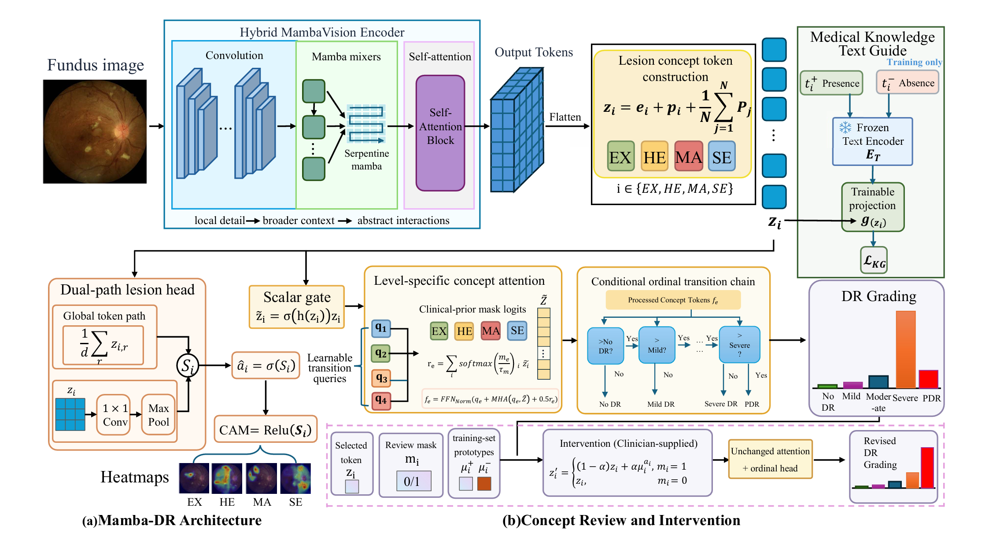

# Mamba-DR: A Clinically Grounded Mamba-Vision Concept Bottleneck for Interpretable and Correctable Diabetic Retinopathy Grading

> **Work in progress.** The first version of our manuscript was submitted on **29 August 2026**. This repository is being prepared alongside the submission; code, instructions, and checkpoints may therefore change.

Mamba-DR is a clinically grounded concept-bottleneck framework for five-level diabetic retinopathy (DR) grading. It combines a hybrid MambaVision encoder with named lesion concepts—hard exudates (EX), hemorrhages (HE), microaneurysms (MA), and soft exudates (SE)—to provide interpretable lesion evidence and support targeted concept review and re-grading.

<p align="center">
  
</p>

## Highlights

- **Hybrid MambaVision encoder:** convolutional stages preserve local retinal detail, serpentine Mamba mixing captures wider context, and late self-attention models high-level interactions.
- **Clinically named concepts:** a dual-path lesion head predicts EX, HE, MA, and SE concepts, grounded with presence and absence clinical descriptions during training.
- **Ordinal DR grading:** level-specific concept attention and a conditional ordinal transition chain predict the ordered DR grades: No DR, Mild, Moderate, Severe, and Proliferative.
- **Concept review and intervention:** an externally specified lesion-concept correction can be propagated through the unchanged grading head to obtain a revised prediction.

## Environment Setup

This project targets **Python 3.12.x**. A CUDA-capable GPU is recommended for training.

Install the remaining dependencies:

```bash
python -m pip install --upgrade pip
pip install torch torchvision
pip install lightning torchmetrics timm mamba-ssm einops \
    albumentations opencv-python pandas pillow numpy \
    scikit-learn prettytable tensorboard transformers mamba-ssm
```

## Dataset Preparation

The annotation CSV files required by this codebase are already located in `data/`. Dataset images are not distributed with this repository and must be obtained under the respective dataset licenses.

### Download the source datasets

- **DDR:** Download OIA-DDR from the [official DDR repository](https://github.com/nkicsl/DDR-dataset). That repository provides the archive and its extraction instructions.
- **FGADR:** Request access through the [official FGADR dataset page](https://csyizhou.github.io/FGADR/). It is provided for non-commercial research under its research-use agreement; do not redistribute the data.

### Expected directory structure

After downloading and preprocessing the images to the required size, arrange the files as follows:

```text
Mamba-DR/
├── data/
│   ├── annotation_DDR_disease.csv
│   ├── annotation_DDR_lesion.csv
│   ├── annotation_FGADR_disease.csv
│   ├── annotation_FGADR_lesion.csv
│   ├── DDR/
│   │   └── fundus_384/
│   │       ├── 007-0031-000.jpg
│   │       └── ...
│   └── FGADR/
│       └── fundus/
│           ├── 0000_1.png
│           └── ...
└── ...
```

The data loader uses each `image_id` from the CSV files to construct the image path. Therefore, retain the CSV identifiers as filenames:

- **DDR:** `data/DDR/fundus_384/<image_id>.jpg`
- **FGADR:** `data/FGADR/fundus/<image_id>.png`

The repository includes preprocessing utilities under `src/preprocess/` if you need to crop or resize raw fundus images. The default input size is 384 × 384.

## Training and Evaluation

Run commands from the repository root. The combined FGADDR configuration trains and evaluates using both DDR and FGADR:

```bash
python src/main.py fit_and_test --config configs/default.yaml --data configs/data/FGADDR.yaml
```

To use one dataset at a time, replace the data configuration:

```bash
# DDR only
python src/main.py fit_and_test --config configs/default.yaml --data configs/data/DDR.yaml

# FGADR only
python src/main.py fit_and_test --config configs/default.yaml --data configs/data/FGADR.yaml
```

The default configuration uses ten-fold splitting (`fold_num: 1`), a batch size of 32, 384 × 384 inputs, and monitors validation quadratic weighted kappa for checkpoint selection. Training logs are written under `log/`.

## Citation

If you use this code, please cite our manuscript. The journal field will be updated after formal acceptance.

```bibtex
@article{lu2026mambadr,
  title   = {Mamba-DR: A Clinically Grounded Mamba-Vision Concept Bottleneck for Interpretable and Correctable Diabetic Retinopathy Grading},
  author  = {Lu, Ziqian and Zhao, Yutao and Tong, Qinyue and Jiang, Mingfeng and Fang, Xian and Yu, Yunlong},
  journal = {},
  year    = {2026},
  note    = {Manuscript submitted}
}
```

## Acknowledgements

Please cite the original DDR and FGADR dataset publications when using their data, and comply with their respective access and research-use terms.
